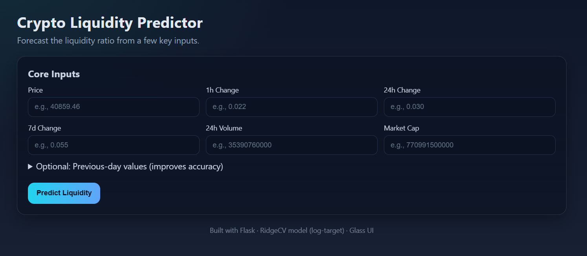
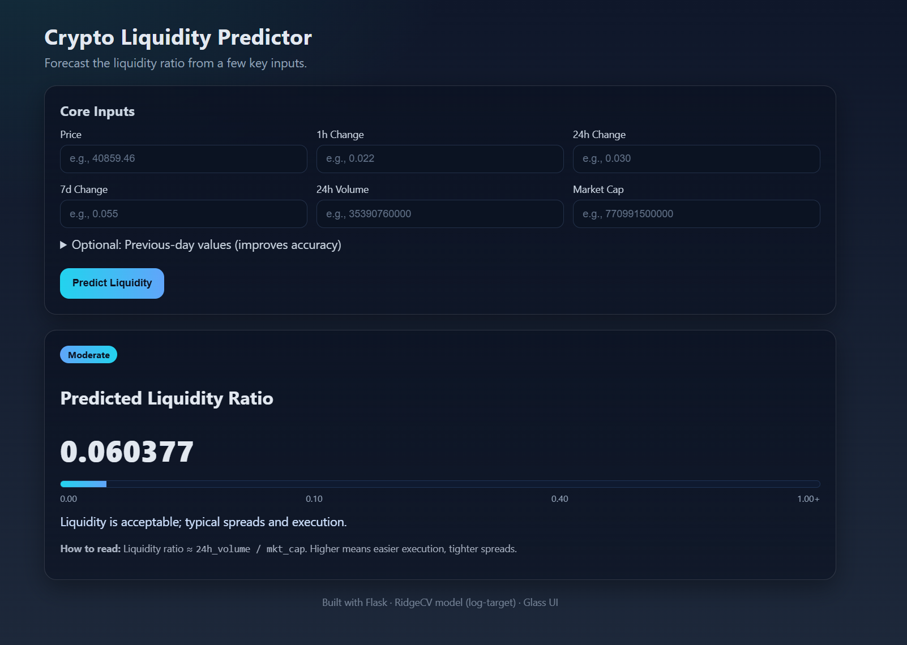
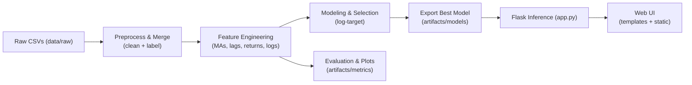
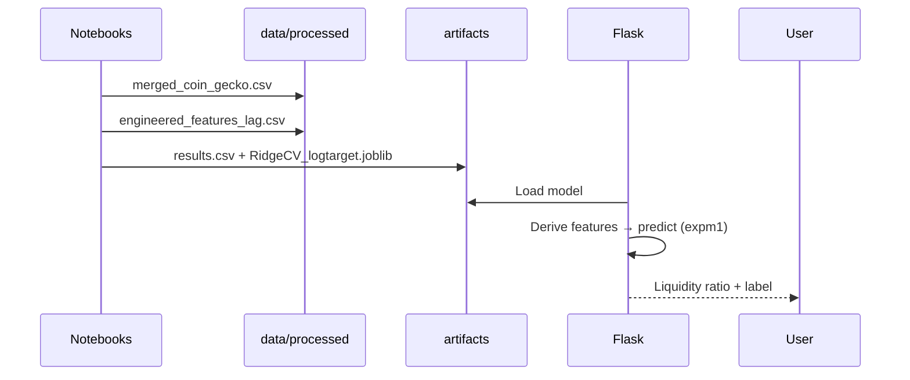

# Cryptocurrency Liquidity Prediction

Predict near-term **liquidity ratio** for cryptocurrencies to flag thin-liquidity regimes.

**Liquidity Ratio (target):**
```
liquidity_ratio = 24h_volume / mkt_cap
```
> Higher ⇒ generally easier execution (tighter spreads, lower slippage).

---




## 📦 Repository Structure

```
crypto_liquidity_project/
├── data/
│   ├── raw/                          # CoinGecko CSVs (input)
│   └── processed/
│       ├── merged_coin_gecko.csv
│       └── engineered_features_lag.csv
├── notebooks/
│   ├── data_preparation.ipynb
│   ├── eda.ipynb
│   ├── feature_engineering.ipynb
│   ├── modeling.ipynb
│   └── evaluation_testing.ipynb
├── artifacts/
│   ├── models/
│   │   └── RidgeCV_logtarget.joblib  # best model (log-target)
│   └── metrics/
│       └── results.csv               # model comparison
├── templates/
│   └── index.html                    # Flask UI (minimal inputs)
├── static/
│   └── style.css                     # modern glass UI
├── app.py                            # Flask server (inference)
├── docs/
│   ├── HLD.md
│   ├── LLD.md
│   └── PIPELINE_ARCHITECTURE.md
└── reports/
    ├── EDA_REPORT.md
    └── FINAL_REPORT.md
```

---

## 🧠 Features

**Inputs (UI asks only core 6):**
- `price`, `1h`, `24h`, `7d`, `24h_volume`, `mkt_cap`

**Derived (server-side, safe defaults if history missing):**
- Trend: `price_ma_3`, `price_ma_5`
- Volatility proxy: `vol_3d`
- Lags: `liquidity_ratio_lag1`, `price_lag1`, `24h_volume_lag1`, `mkt_cap_lag1`
- DoD change: `price_ret_1d`, `vol_chg_1d`, `mcap_chg_1d`
- Stabilizers: `log_price`, `log_vol`, `log_mcap`

**Target for training:** `log1p(liquidity_ratio)` (skew-robust); inference uses `expm1` to return to original scale.

---

## 📈 Modeling

- Tried: Linear, **RidgeCV**, Lasso, RandomForest, XGBoost, LightGBM, HistGB.
- **Best (stable & accurate):** `RidgeCV` on log-target with scaled features.
- Evaluation (example run): `RMSE ≈ 0.081, MAE ≈ 0.034, R² ≈ 0.95`

---

## Data Flow (Pipeline)



## Orchestration (sequence)


## ▶️ Run Locally

### 1) Environment
```bash
python -m venv .venv
# Windows
.venv\Scripts\activate
# macOS/Linux
source .venv/bin/activate

pip install -r requirements.txt
```

### 2) Notebooks (recommended order)
1. `notebooks/data_preparation.ipynb`
2. `notebooks/eda.ipynb`
3. `notebooks/feature_engineering.ipynb`
4. `notebooks/modeling.ipynb`
5. `notebooks/evaluation_testing.ipynb`

### 3) Start the Flask app
```bash
python app.py
# open http://127.0.0.1:5000/
```

The UI accepts the 6 core inputs and shows:
- Predicted liquidity ratio
- Interpretable badge: *Very Low / Low / Moderate / High / Very High*

---

## 📜 Reports & Docs

- `reports/EDA_REPORT.md` — distributions, correlations, key plots
- `reports/FINAL_REPORT.md` — executive summary, results, limitations
- `docs/HLD.md` — high-level system overview
- `docs/LLD.md` — feature definitions, functions, endpoints
- `docs/PIPELINE_ARCHITECTURE.md` — pipeline, flow, commands

---

## ✅ Submission Checklist

- [ ] Source code (notebooks, `app.py`, templates, CSS, artifacts)
- [ ] EDA Report
- [ ] HLD & LLD
- [ ] Pipeline Architecture
- [ ] Final Report
- [ ] Best model (`artifacts/models/*.joblib`) + metrics CSV
- [ ] Processed data CSVs (`data/processed/*.csv`)

---

## ⚠️ Notes

- Model was serialized with scikit-learn 1.5.x. If you see a version warning while loading,
  prefer re-training with your local sklearn and re-saving the model.
- Liquidity ratio is a **proxy** for true market liquidity. For production,
  integrate order-book depth and spreads when available.
