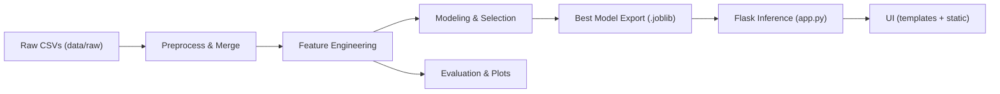
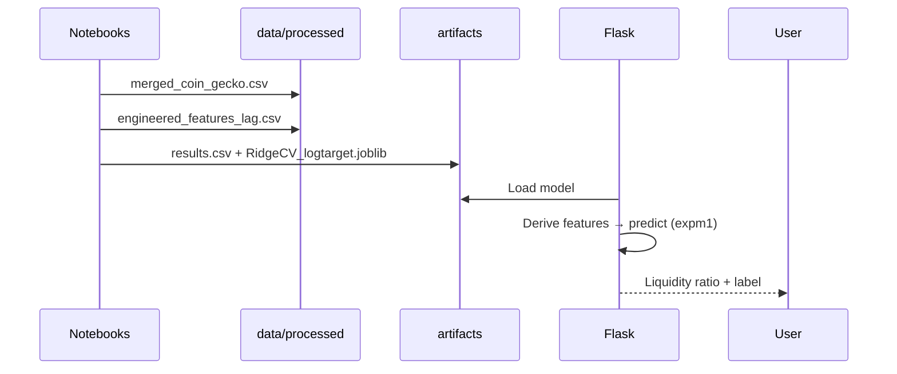

# Pipeline & Architecture

> End-to-end blueprint for the Cryptocurrency Liquidity Prediction project:
> how data flows, how features/models are produced, and how the Flask app serves predictions.

## Repository Layout
```
crypto_liquidity_project/
├── data/
│   ├── raw/
│   └── processed/
│       ├── merged_coin_gecko.csv
│       └── engineered_features_lag.csv
├── notebooks/
│   ├── data_preparation.ipynb
│   ├── eda.ipynb
│   ├── feature_engineering.ipynb
│   ├── modeling.ipynb
│   └── evaluation_testing.ipynb
├── artifacts/
│   ├── models/
│   │   └── RidgeCV_logtarget.joblib
│   └── metrics/
│       └── results.csv
├── templates/index.html
├── static/style.css
├── app.py
├── docs/
│   ├── HLD.md
│   ├── LLD.md
│   └── PIPELINE_ARCHITECTURE.md
└── reports/
    ├── EDA_REPORT.md
    └── FINAL_REPORT.md
```
## Dataflow


## Orchestration (sequence)


## Run Commands
```bash
python -m venv .venv
.venv\Scripts\activate
pip install -r requirements.txt
python app.py
```
